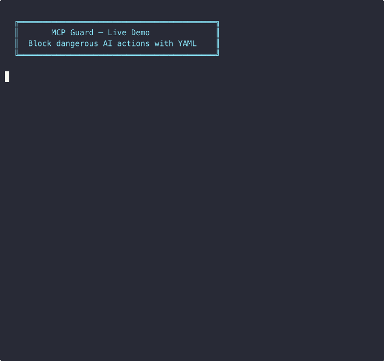

# MCP Guard

**Stop your AI agents from doing dangerous things.**

Define what's allowed, blocked, or requires approval — in a single YAML file. MCP Guard sits between your MCP client and server, enforces the rules, and logs every decision as an audit receipt.

Without MCP Guard, your agent can call any tool. With it, every action is checked.

→ **Blocks** unsafe tool calls before they execute
→ **Holds** sensitive actions for human approval
→ **Logs** every decision as an immutable receipt
→ **Observe mode** — audit what would be blocked before enforcing

<p align="center">
  
</p>

## Get Started (2 minutes)

```bash
# Install
npm install @permissionprotocol/mcp-guard

# Create a policy file
cat > pp.config.yaml << 'EOF'
default_action: allow
rules:
  - id: block-delete
    tool: delete_user_data
    action: block
  - id: hold-deploy
    tool: deploy_production
    action: require_approval
EOF

# Run your MCP server through the guard
mcp-guard --config pp.config.yaml -- node my-mcp-server.js
```

That's it. Your agent can no longer delete user data. Production deploys require approval. Everything is logged to `pp-receipts.jsonl`.

## Architecture

```
┌────────────┐     stdio      ┌─────────────┐     stdio      ┌────────────┐
│  MCP Client│ ──────────────▶│  MCP Guard   │──────────────▶ │ MCP Server │
│  (Claude,  │                │  (proxy)     │                │ (your app) │
│   Cursor)  │ ◀──────────────│              │◀────────────── │            │
└────────────┘   responses    └─────────────┘   responses    └────────────┘
                                    │
                                    ▼
                              pp-receipts.jsonl
                              (audit trail)
```

MCP Guard intercepts JSON-RPC messages on stdin/stdout. When it sees a `tools/call` request:

1. Looks up the tool name in the config rules
2. If **allowed** → forwards to the real server
3. If **blocked** → returns a JSON-RPC error (`-32001`) directly
4. If **held for approval** → returns a JSON-RPC error (`-32002`) directly
5. Emits a receipt for every decision (stderr + jsonl file)

All other JSON-RPC methods pass through transparently.

## Config Reference

```yaml
# pp.config.yaml
default_action: allow  # "allow" or "block" — applies when no rule matches
mode: enforce          # "enforce" (default) or "observe" (log only, never block)

rules:
  - id: unique-rule-id        # Human-readable identifier
    tool: tool_name            # Exact match on MCP tool name
    action: allow              # allow | block | require_approval
```

### Modes

| Mode | Behavior |
|------|----------|
| `enforce` | Block/hold tool calls per rules (default) |
| `observe` | Log decisions + emit receipts, but always forward (dry-run) |

Use `observe` mode to audit what *would* be blocked before turning enforcement on. Switch via config or CLI: `--mode observe`.

### Actions

| Action | Behavior | JSON-RPC Error Code |
|--------|----------|-------------------|
| `allow` | Forward request to server | — |
| `block` | Reject immediately | `-32001` |
| `require_approval` | Reject with hold status | `-32002` |

## Receipts

Every `tools/call` decision generates an immutable receipt:

```json
{
  "receipt_id": "550e8400-e29b-41d4-a716-446655440000",
  "timestamp": "2026-03-20T15:30:00.000Z",
  "agent_id": "my-agent",
  "tool_name": "delete_user_data",
  "decision": "blocked",
  "reason": "Matched rule \"block-dangerous-delete\"",
  "rule_id": "block-dangerous-delete",
  "request_payload_hash": "sha256-hex-string",
  "target_server": "node my-mcp-server.js",
  "mode": "enforce"
}
```

Receipts are written to:
- **stderr** — for real-time monitoring
- **pp-receipts.jsonl** — append-only audit file

The `request_payload_hash` is a SHA-256 of the full request params, so you can verify what was sent without storing sensitive arguments.

## CLI

```
mcp-guard [options] -- <server command>

Options:
  --config <path>     Path to config file (default: ./pp.config.yaml)
  --agent-id <id>     Agent identifier for receipts (default: "unknown")
  --mode <mode>           enforce or observe (overrides config file)
  --approval-port <port>  Enable approval UI on this port (e.g. 3100)
  -h, --help              Show help
```

### Example: Claude Desktop

In your Claude Desktop MCP config, replace:

```json
{
  "mcpServers": {
    "my-server": {
      "command": "node",
      "args": ["my-mcp-server.js"]
    }
  }
}
```

With:

```json
{
  "mcpServers": {
    "my-server": {
      "command": "mcp-guard",
      "args": ["--config", "pp.config.yaml", "--agent-id", "claude-desktop", "--", "node", "my-mcp-server.js"]
    }
  }
}
```

## Approval Flow (v0.1)

When a tool call matches a `require_approval` rule, MCP Guard can hold the request open and wait for human approval via a web UI — instead of rejecting immediately.

```bash
# Start with approval UI on port 3100
mcp-guard --config pp.config.yaml --approval-port 3100 -- node my-mcp-server.js

# Open http://localhost:3100 to see pending approvals
```

**How it works:**
1. Agent calls a tool that requires approval
2. MCP Guard holds the JSON-RPC response open (does NOT return an error)
3. The tool call appears in the approval UI at `http://localhost:<port>`
4. Human clicks **Approve** → request is forwarded to the server, response returned to the agent
5. Human clicks **Deny** → JSON-RPC error (-32002) returned to the agent

When `--approval-port` is **not** set, `require_approval` tools return an error immediately (original behavior, no change).

The approval UI auto-refreshes every 3 seconds and shows:
- Pending tool calls with collapsible arguments
- Recent decision history (last 20)

## What This Is NOT

- **Not a dashboard.** It's a proxy. It sits in the data path and enforces rules.
- **Not a scanner.** It doesn't analyze your code or model outputs. It gates tool calls.
- **Not compliance theater.** Every decision has a cryptographic receipt. No hand-waving.
- **Not a replacement for good architecture.** It's one layer in a defense-in-depth strategy.

## Try the Demo

```bash
git clone https://github.com/permission-protocol/mcp-guard
cd mcp-guard
npm install && npm run build
bash example/test.sh
```

See [example/README.md](example/README.md) for details.

## Part of Permission Protocol

MCP Guard is a building block of the [Permission Protocol](https://github.com/permission-protocol) governance framework — explicit authority for autonomous AI systems.

## License

MIT
